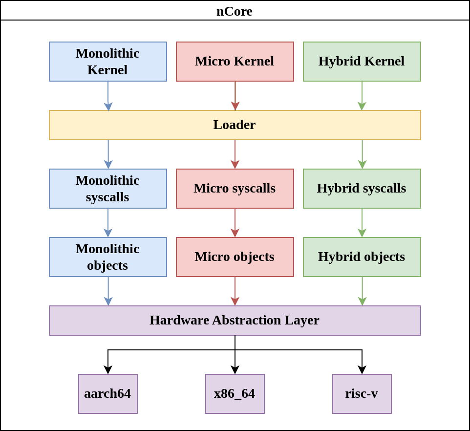
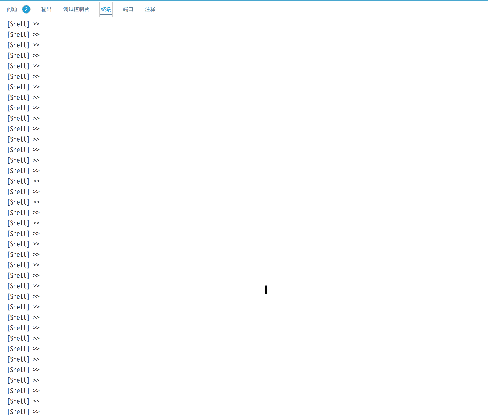

# mini-Rust-OS


## 简介

  - 本项目从零实现了一个X86架构的实验性操作系统内核，使用Rust开发
  
  - 本项目的出发点是探索不同的内核架构对内核安全性与性能的影响并尝试权衡二者
    
  - 从宏内核出发，吸收借鉴微内核的设计模式来提高安全性的同时保证一定的性能

## 特点

  - 采用`混合内核架构`，非核心的内核服务（如设备驱动）运行在独立的内核线程中

  - 利用Rust无栈异步协程实现`多对多线程模型`，所有用户线程共享内核栈

  - 我们认为内核线程中运行是不可靠代码，在其故障崩溃时内核本身不会崩溃，并可以`尝试重启内核线程`以恢复服务

## 在线文档
  我们在[NUDT-OS-BOOK](https://flying-rind.github.io/mini-Rust-os/)中更加详细地介绍了内核的设计原则和一些特点

## 效果演示
  在[效果演示](https://flying-rind.github.io/mini-Rust-os/md/%E6%95%88%E6%9E%9C%E6%BC%94%E7%A4%BA.html)中有几个具体的例子演示


## 内核架构
NUDT-OS旨在从类UNIX宏内核出发，吸收学习微内核设计思想，以尝试权衡系统性能与可靠性。

* 针对传统宏内核的安全性问题，NUDT-OS将非核心的系统服务放在相互独立的内核线程中运行以增强系统安全可靠性，所有内核线程共享地址空间，由Rust语言特性保证线程间的访存隔离性。

* 针对微内核频繁IPC导致的性能问题，NUDT-OS的内核线程共享地址空间，不同线程间可以直接通信，避免了IPC开销。

* 使用Rust无栈异步协程实现了多对多线程模型，所有用户线程共享内核栈。
  
总体内核架构图如下，我们在[NUDT-OS-BOOK](https://flying-rind.github.io/mini-Rust-os/)中更加具体地介绍了内核设计思路和架构。


## 代码目录树
```
.
├── boot                    // 启动内核
├── crates                  // 有修改的第三方库
├── executor                // 协程执行器
├── hal                     // 硬件抽象层
├── hybrid-objects          // 混合内核对象
├── hybrid-syscalls         // 混合内核系统调用
├── loader                  // 加载器
├── micro-objects           // 微内核对象
├── micro-syscalls          // 微内核系统调用
├── monolithic-objects      // 宏内核对象
├── monolithic-syscalls     // 宏内核系统调用
├── musl                    // musl源码
├── Ncore                   // 顶层内核
├── rcore-fs-use            // 构建文件系统
├── tutorial                // 文档
├── user-c                  // C语言用户程序
├── user-components         // 用户态组件
└── user-rs                 // Rust用户程序
``` 


## 编译运行
使用Liunx开发，目前可运行于Qemu模拟器，还未在裸机测试，经过简单修改应该可以运行于x86开发板。

### 安装依赖
```shell
sudo apt install make git gcc qemu-system-x86 
curl --proto '=https' --tlsv1.2 -sSf https://sh.rustup.rs | sh
rustup component add rust-src --toolchain nightly-x86_64-unknown-linux-gnu
```

### 运行
```shell
make run
# 之后终端会进入系统最终出现命令提示符：
Rust user sehll
[Shell]>>
```

完整运行效果如下：(Ubuntu qemu平台)



上面展示了文件系统内核线程出现致命异常（手动模拟的），内核重启内核线程。

### 调试（两个终端分别执行）

```shell
make gdb
gdb -n -x .gdbinit
```

### 文档
```shell
# 本地构建文档
cargo install mdbook
cd tutorial
mdbook build --open
```
或查看在线文档：[NUDT-OS-BOOK](tutorial/book/md/引言.html)

### 清除已编译文件

```shell
make clean
```

## 参考资料与仓库

参考内核架构与代码

- [rcore-tutorial-x86-64](https://github.com/rcore-os/rCore-Tutorial-v3-x86_64)

- [rcore-tutorial](https://github.com/rcore-os/rCore-Tutorial-v3)

- [zcore](https://github.com/rcore-os/zCore)

使用了多个rcore社区中开源的工具，下面列出了一些

- [trapframe-rs](https://github.com/rcore-os/trapframe-rs)

- [isomorphic_drivers](https://github.com/rcore-os/isomorphic_drivers)

- [pci](https://github.com/rcore-os/pci-rs)

- [bitmap-allocator](https://github.com/rcore-os/bitmap-allocator)

详细的依赖可以查看[kernel/Cargo.toml](kernel/Cargo.toml)