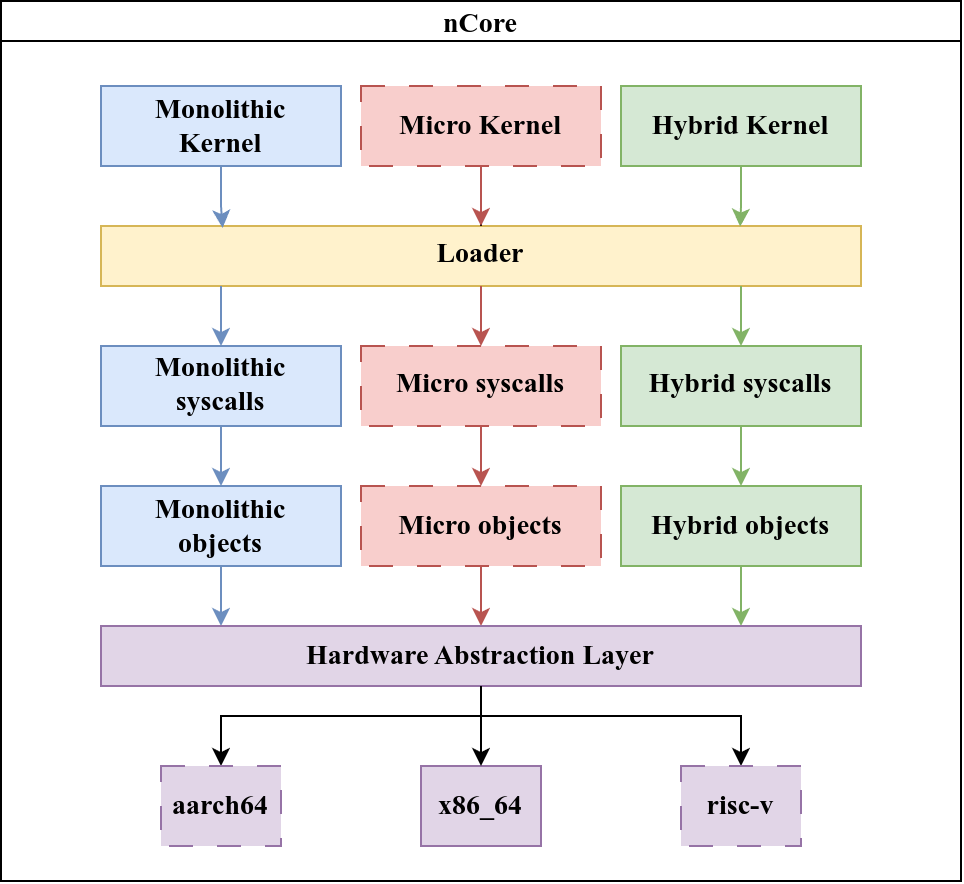

# mini-Rust-OS

## 说明 

- 选题：`proj382`

- 学校：`国防科技大学`

- 队伍：`黑袍纠察队`

- 参赛队编号：`T202590002996118`


## 简介

  - 本项目从零实现了一个X86架构的实验性操作系统内核，使用Rust开发
  
  - 本项目目的是结合宏内核和微内核的优点，实现一种可靠性增强的内核架构
    
  - 从宏内核出发，吸收借鉴微内核的设计模式来提高安全性的同时保证一定的性能

  - 内核启动时，可以选择宏内核或混合内核两种启动模式

## 特点

  - 采用`混合内核架构`增强内核可靠性，非核心的内核服务（如设备驱动、文件系统）运行在独立的`内核服务线程`中

  - 每个内核服务线程拥有`独立内核栈和控制流`

  - 我们认为内核线程中运行是不可靠代码，在其故障崩溃时内核本身不会崩溃，并可以`尝试重启内核线程`以恢复服务

  - 利用Rust无栈异步协程实现`多对多线程模型`，所有用户线程共享内核栈

  - 实现了宏内核与混合内核`两种内核架构`


## 在线文档
  我们在[NUDT-OS-BOOK](https://flying-rind.github.io/mini-Rust-os/)中更加详细地介绍了内核的设计原则和一些特点

## PPT

  在[一种基于Rust语言的内核服务可靠性增强设计与实现](tutorial/一种基于Rust语言的操作系统内核服务可靠性增强设计与实现.pptx)中

## 效果演示
  在[效果演示](https://flying-rind.github.io/mini-Rust-os/md/%E6%95%88%E6%9E%9C%E6%BC%94%E7%A4%BA.html)演示了内核运行效果


## 内核架构
NUDT-OS实现了宏内核、混合内核两种架构，微内核架构还在实现中。宏内核的实现主要是为了与混合内核进行对比测试。混合内核架构旨在结合宏内核和微内核设计思想，以权衡系统性能与可靠性。具体来说，NUDT-OS中的混合内核：

* 针对传统宏内核的可靠性问题，NUDT-OS将非核心的系统服务放在相互独立的内核线程中运行以增强系统可靠性，所有内核线程共享地址空间，由Rust语言特性保证线程间的访存隔离性。

* 针对微内核频繁IPC导致的性能问题，NUDT-OS的内核线程共享地址空间，不同线程间可以直接通信，避免了IPC开销。

* 使用Rust无栈异步协程实现了多对多线程模型，所有用户线程共享内核栈。
  
混合内核架构图如下，我们在[NUDT-OS-BOOK](https://flying-rind.github.io/mini-Rust-os/)中更加具体地介绍了内核设计思路和架构。


## 代码目录树
项目的代码目录树如下
```
.
├── boot                    // 启动内核
├── crates                  // 有修改的第三方库
├── executor                // 协程执行器
├── hal                     // 硬件抽象层
├── hybrid-objects          // 混合内核对象
├── hybrid-syscalls         // 混合内核系统调用
├── loader                  // 加载器
├── micro-objects           // 微内核对象（尚未实现）
├── micro-syscalls          // 微内核系统调用（尚未实现）
├── monolithic-objects      // 宏内核对象
├── monolithic-syscalls     // 宏内核系统调用
├── musl                    // musl源码
├── Ncore                   // 顶层内核
├── rcore-fs-use            // 构建文件系统
├── tutorial                // 文档
├── user-c                  // C语言用户程序
├── user-components         // 用户态组件
└── user-rs                 // Rust用户程序
``` 
项目整体的架构如下：



虚线部分表示还未完成的部分。项目采用层次化的软件开发方法，内核自底向上被划分为硬件抽象层、内核对象层、系统调用层、加载器层、几个层次，下层靠近硬件，上层远离硬件，每层都依赖下层提供的接口与服务，但同一层的模块之间没有依赖关系，可以并行地开发。

硬件抽象层（Hardware Abstraction Layer，HAL）定义一套硬件操作API，提供给上层的内核对象使用，且上层内核对象只能通过HAL层的API来操作硬件。HAL层只给出接口定义，具体的实现可以有多种硬件架构，如x86\_64、aarch64等（图中的虚线部分表示还未实现），

内核对象层（Kernel Objects）基于HAL层给出的硬件接口，实现内核数据结构和他们的方法（如进程线程等）。为了实现多种内核架构，分别设计实现对应的内核对象。

系统调用层（Syscall Layer）根据内核对象的方法实现系统调用接口。相应的也分别存在多种内核架构对应的内核系统调用。

加载器（Loader）位于系统调用层之上，其向下使用系统调用层给出的系统调用API，完成内核对象初始化、系统调用入口设定、第一个用户程序加载和启动的工作。

最终形成宏内核、微内核（尚未实现）、混合内核三种内核架构。

## 编译运行
使用Liunx开发，目前可运行于Qemu模拟器，还未在裸机测试，经过简单修改应该可以运行于x86开发板。

### 安装依赖
```shell
sudo apt install make git gcc qemu-system-x86 
curl --proto '=https' --tlsv1.2 -sSf https://sh.rustup.rs | sh
rustup component add rust-src --toolchain nightly-x86_64-unknown-linux-gnu
```

### 运行
```shell
make run
# 之后终端会进入系统最终出现命令提示符：
Rust user sehll
[Shell]>>
```

完整运行效果如下：(Ubuntu qemu平台)


上面展示了文件系统内核线程出现致命异常（手动模拟的），内核重启内核线程。

### 调试（两个终端分别执行）

```shell
make gdb
gdb -n -x .gdbinit
```

### 文档
```shell
# 本地构建文档
cargo install mdbook
cd tutorial
mdbook build --open
```
或查看在线文档：[NUDT-OS-BOOK](tutorial/book/md/引言.html)

### 清除已编译文件

```shell
make clean
```

## 参考资料与仓库

参考内核架构与代码

- [rcore-tutorial-x86-64](https://github.com/rcore-os/rCore-Tutorial-v3-x86_64)

- [rcore-tutorial](https://github.com/rcore-os/rCore-Tutorial-v3)

- [zcore](https://github.com/rcore-os/zCore)

使用了多个rcore社区中开源的工具，下面列出了一些

- [trapframe-rs](https://github.com/rcore-os/trapframe-rs)

- [isomorphic_drivers](https://github.com/rcore-os/isomorphic_drivers)

- [pci](https://github.com/rcore-os/pci-rs)

- [bitmap-allocator](https://github.com/rcore-os/bitmap-allocator)