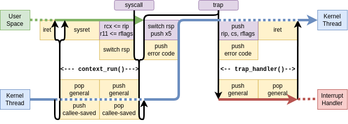

# 中断处理和系统调用

> 关于中断和系统调用处理我们使用了rcore社区的[TrapFrame](https://github.com/rcore-os/trapframe-rs)开源库

NUDT-OS是x64架构的，由于采用了`syscall`快速系统调用指令，系统调用控制流和中断控制流不同。本章分别介绍中断和系统调用的控制流和处理过程。

`TrapFrame`库将中断和系统调用控制流封装在了`UserContext.run()`方法中，我们这里不对代码作出解释，只是概述性地描述控制流。

> 下图来自TrapFrame库



`UserContext.run()`方法用`UserContext`中的寄存器来恢复线程并进入用户态执行，直到发生中断或者系统调用。这时控制流返回Rust，我们需要手动处理中断或系统调用，调用`handle_user_trap()`函数。

可以把中断和系统调用分成下面几种情况：

- 用户态中断：控制流返回Rust（也就是手动调用`UserContext.run()`之后）
- 内核态发生中断：直接跳转到手动编写的`trap_handler`
- 用户态系统调用：控制流返回Rust


```Rust
#[no_mangle]
/// 中断处理入口，由汇编直接调用无需手动调用
pub extern "C" fn trap_handler(tf: &mut TrapFrame) {
    handle_trap(Some(tf), None, None);
}

/// 处理用户态的中断或系统调用
/// 若是系统调用则context中的trap_num一定为100
/// 若是中断则trap_num从context中获取
pub fn handle_user_trap(thread: Arc<Thread>, context: &UserContext) {
    handle_trap(None, Some(thread), Some(context));
}
```

可见不管是内核还是用户中断/系统调用最终都进入到`handle_trap()`函数，我们在下一节说明这个函数