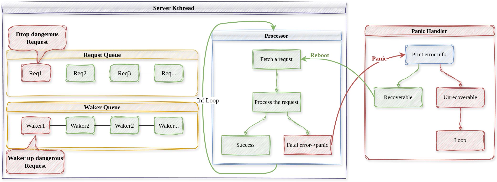

# 内核服务线程故障恢复机制设计

## 基于panic的故障恢复机制

我们认为内核服务线程中运行的代码是不完全可靠的，可能会发生故障，内核如何捕获内核服务线程中的错误并进行恢复处理呢？下面的流程图解释了具体的控制流。



上图中，红色的部分表示有错误的控制流或请求，绿色表示正常的控制流。

当程序发生某些严重的错误时，Rust会抛出panic异常，这时控制流会跳转到程序中的全局panic处理程序`panic handler`中，我们就在`panic handler`中尝试恢复内核线程。

```Rust
#[panic_handler]
fn panic(info: &PanicInfo) -> ! {
    // 打印错误信息
    ....
    // 若是内核服务线程崩溃了，尝试恢复错误
    let current_kthread = CURRENT_KTHREAD.get().as_ref().unwrap().clone();
    match current_kthread.ktype() {
        KthreadType::BLK | KthreadType::FS => {
            let current_req_id = current_kthread.current_request_id();
            println!(
                "\x1b[31m[Panic handler] Trying to Reboot..., the dangerous request(ID: {}) will be dropped!\x1b[0m",
                current_req_id
            );
            // 重启内核线程
            current_kthread.reboot(current_kthread.clone());
        }
    }
    loop {}
}
```
`panic handler`首先将错误信息打印出来告知用户，再判断错误是否可以恢复，若是内核服务线程发生错误，则尝试重启内核线程以恢复错误。

```Rust
/// 重启内核线程，当内核线程内发生严重错误panic时在panic handler中使用（测试）
///
/// 首先唤醒出现错误的请求，重启后不再处理
///
/// 重置当前内核线程的rip和rsp，并不保存上下文切换到其他内核线程执行
pub fn reboot(&self, current_kthread: Arc<Kthread>) {
    // 重置上下文
    let current_req_id = self.current_request_id.get().clone();
    let context = self.context.get_mut();
    context.rip = processor_entry as usize;
    context.regs.rsp =
        KERNEL_STACK_BASE + self.ktid * KERNEL_STACK_SIZE * 2 + KERNEL_STACK_SIZE;
    // 唤醒出错的请求
    self.wake_request(current_req_id);
    let kthread = Scheduler::get_first_kthread().unwrap();
    KTHREAD_DEQUE.get_mut().push_back(current_kthread.clone());
    // 修改全局变量，且不保存寄存器
    *CURRENT_KTHREAD.get_mut() = Some(kthread.clone());
    current_kthread.switch_to_without_saving_context(kthread);
}
```
重启内核线程时，首先**唤醒出错的请求**，不然等待的内核线程将永远处于等待状态，我们认为出错的请求是危险的，将其丢弃重启后不再处理。然后将内核线程**rip和rsp现场恢复到初始状态**，当调度器再次调度错误内核线程时，从下一个请求开始继续处理。
