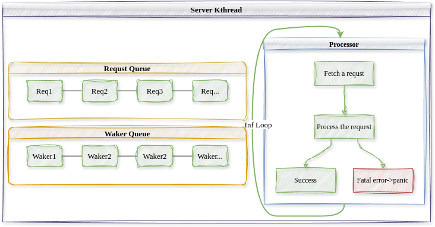

# 内核服务线程设计


## 设计原则
操作系统内核提供的服务大致可以分为核心服务(如虚拟内存管理、进程线程管理、中断和系统调用管理)和非核心服务(如文件系统服务、设备驱动服务)。驱动程序等非核心服务代码质量有好有坏,为了防止其破坏内核地址空间,微内核将非核心服务实现为用户态的进程,每个进程都有由硬件保证的隔离的地址空间,从而每个非核心服务保持独立性且不能破坏任何内核数据结构。但是频繁的地址空间切换也导致了显著的性能开销。与微内核相反,在 Linux 这种宏内核中,驱动程序等非核心服务直接运行在内核空间中,运行时其地位与内核代码等价,如果一个低质量的驱动程序崩溃,那整个系统也就崩溃了,从而提供了较好的性能但可靠性较差。

混合内核内核服务线程的设计是在宏内核与微内核两者之间的一种折中:类似于微内核,混合内核将每个非核心的系统服务放置在一个相对独立的内核服务线程中,其拥有独立的内核栈与控制流,由 Rust 语言本身来一定程度地保证多个内核服务线程的访存隔离性,然而所有内核服务线程共享内核地址空间,这样相对于微内核而言,不同的内核服务线程通信时不需要切换地址空间从而避免了昂贵的性能开销。

本质上来说,我们认为内核服务线程中运行的驱动程序代码不完全可靠,有可能崩溃,然而独立的内核服务线程设计允许在某个内核服务线程崩溃时不影响内核整体,也不影响其他的内核服务线程,内核可以尝试重启崩溃的内核服务线程。



上图描述了内核服务线程的结构。类似于微内核中不同的用户进程之间采用
消息(Message)传递的方式进行通信,在混合内核中,用户线程通过发送请求
(Request)的方式请求内核线程服务,请求是用户线程对于自己希望获得的服务
进行的描述,用户线程需要内核提供的非核心服务时,其构造一个请求并通过内
核将其发送给对应的内核服务线程。一个特定的内核服务线程服务所有需要这种
内核服务的用户线程,所以内核服务线程中维护一个待完成的请求队列(Request
Queue),内核服务线程从请求队列中取出并解析请求,完成相应的服务后,通过
唤醒器(Waker)通知发出请求的用户线程。唤醒器是内核服务线程持有的发出请
求的用户线程的一个句柄,用于在请求完成时通知用户线程以改变它的状态,因
此内核服务线程还维护一个唤醒器队列(Waker Queue)。
在基于请求和唤醒的通信方式下,所有内核服务线程的控制流保持一致的形
式,即不断循环,取出请求队列中就绪的请求,处理请求,再通知发出请求的用
户线程请求已经处理完毕。

## 自定义请求

```Rust
/// 内核线程
///
/// 每个内核线程有独立的内核栈
#[derive(Default)]
pub struct Kthread {
    /// 内核线程ID
    ktid: usize,
    /// 内核线程名称
    name: String,
    /// 内核线程的内核态上下文
    context: Cell<Box<KernelContext>>,
    /// 运行状态
    state: Cell<KthreadState>,
    /// 服务类型
    #[allow(unused)]
    ktype: KthreadType,
    /// 用户请求的实际处理器
    processor: Option<Arc<dyn Processor>>,
    /// 请求队列
    request_queue: Cell<VecDeque<(Request, usize)>>,
    /// 请求的唤醒器队列
    request_wakers: Cell<Vec<(Waker, usize)>>,
    /// 最新的请求ID
    request_id: Cell<usize>,
    /// 已经响应的请求ID
    response_id: Cell<usize>,
    /// 当前正在处理的请求的ID
    current_request_id: Cell<usize>,
}
```
`Kthread`结构体描述了内核服务线程，其包含了一个请求队列，其中存放了所有用户程序发送的请求。请求其实是一个字节序列：

```Rust
/// 用户向内核线程发送的请求
///
/// 用户发送请求时将其转化为字节，用户态再重新解析
pub type Request = Vec<u8>;
```
用户线程在发送请求时将请求类型转为字节，内核线程在处理请求时需要将字节解析为具体的请求类型。下面是文件系统服务的请求类型实例。

```Rust
pub type Fd = usize;
pub type Pid = usize;
pub type BufPtr = usize;
pub type BufLen = usize;
pub type PathPtr = usize;
pub type FLAGS = u32;
pub type FdPtr = usize;
pub type ResultPtr = usize;

/// 文件系统类请求描述信息
#[derive(Debug, Clone, Copy)]
pub enum FsReqDescription {
    /// 读磁盘文件，在sys_read中被构造
    Read(Pid, Fd, BufPtr, BufLen, ResultPtr),
    /// 写磁盘文件，在sys_write中被构造
    Write(Pid, Fd, BufPtr, BufLen, ResultPtr),
    /// 打开一个磁盘文件，将句柄写入FdPtr中，
    /// 在sys_open中构造
    Open(Pid, PathPtr, FLAGS, FdPtr),
}

impl CastBytes for FsReqDescription {}
```

## 请求处理

```Rust
/// 服务内核线程统一入口，内部通过内核线程的
/// processor对象来具体处理请求
pub fn processor_entry() {
    // 获取内核线程
    let kthread = CURRENT_KTHREAD.get().as_ref().unwrap().clone();
    // 获取请求处理器
    let processor = kthread.processor();
    let processor = processor.unwrap();
    // 循环响应请求
    loop {
        // 获取请求
        let (req, req_id) = match kthread.get_first_request() {
            Some((req, req_id)) => {
                kthread.set_current_request_id(req_id);
                (req, req_id)
            }
            None => {
                // 请求队列为空，则设置自己为Idle，放弃CPU直到请求入队时改变状态为NeedRun
                kthread.set_state(KthreadState::Idle);
                Scheduler::yield_current_kthread();
                continue;
            }
        };
        // 处理请求
        processor.process_request(req);
        // 响应请求，唤醒等待协程
        kthread.wake_request(req_id);
    }
}
```
所有内核服务线程的控制流都保持一致，即不断循环，处理自己请求队列中的请求，并唤醒等待的用户线程。上面的processor是由内核服务线程类型决定的请求处理器，不同的驱动程序有不同的处理器，由其完成具体的处理过程。
