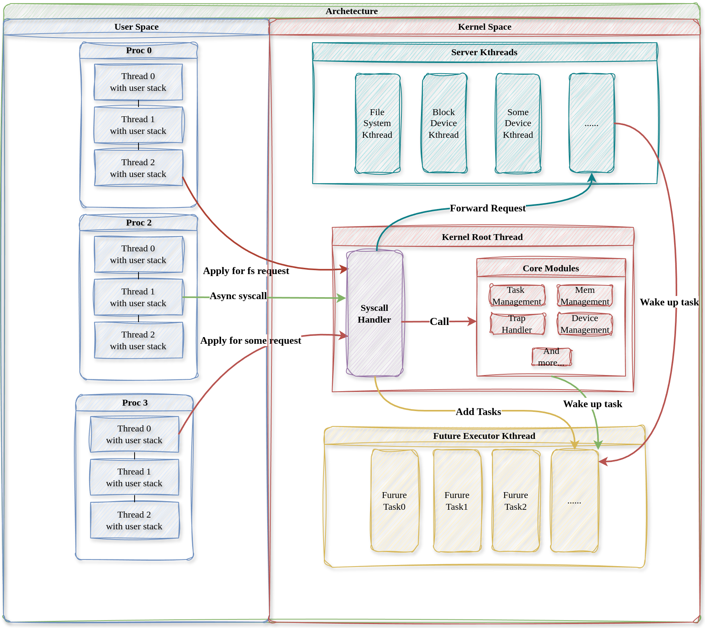

# 内核架构

本章首先简要介绍传统操作系统宏内核和微内核架构的设计理念和优劣，再介绍NUDT-OS的内核架构设计。

## 传统宏内核架构

以Linux为代表的宏内核架构将所有功能模块（文件系统、网络栈、设备驱动等）都集成在内核态中运行。宏内核的优势在于其性能极好，软硬件生态丰富。但缺点也十分明显：一是可靠性问题，由于用户服务与内核服务都运行在内核态中，且内核各个组件的高度耦合性，任何一个模块的缺陷都可能导致整个系统的崩溃；二是内核的可维护性和可拓展性差，这同样是源于内核模块的高度耦合。

## 传统微内核架构

以Minix、seL4、Zircon等为代表的微内核架构则采用与宏内核完全不同的设计原则，将内核中的各个功能模块尽可能从内核中剥离，并作为独立的服务进程运行在用户态。相比于宏内核，微内核更小，高度模块化，具有更高的可靠性与安全性，单一模块的缺陷无法传播至其他模块，但缺点同样显著：内核外组件间的基于进程间通信的交互方式显著会影响系统性能。

## 混合内核架构

以Windows NT、macOS\IOS、鸿蒙系统为代表的混合内核融合多种内核特性。试图寻找系统性能与安全可靠性之间的折衷。
Windows NT融合了宏内核的性能、生态优势，以及微内核的可靠性优势，将部分与性能、安全相关的功能模块下沉到内核中，以内核线程的形式解决性能问题；
macOS因兼容性问题保留了微内核，但为了提高系统性能增加宏内核，用户可通过不同的系统调用决定使用哪个内核；
鸿蒙为适配不同硬件平台特性，支持在不同硬件平台选择不同内核。

## NUDT-OS内核架构

NUDT-OS旨在从类UNIX宏内核出发，吸收学习微内核设计思想，以追求系统性能与可靠安全之间的平衡。

* 针对传统宏内核的安全性问题，NUDT-OS将非核心的系统服务放在相互独立的内核线程中运行以增强系统安全可靠性，所有内核线程共享地址空间，由Rust语言特性保证线程间的访存隔离性。

* 针对微内核频繁IPC导致的性能问题，NUDT-OS的内核线程共享地址空间，不同线程间可以直接通信，避免了IPC开销。
  
总体内核架构图如下：

NUDT-OS中存在多个用户线程和多个内核线程：
- 内核主线程负责处理同步系统调用和分发用户线程的请求（异步系统调用）并执行调度

- 内核中的多个内核服务线程为用户提供文件系统、设备驱动等服务，他们保持相对独立，每个都有自己的特定任务

- 内核协程执行线程调度用户线程请求产生的协程，在服务完成时唤醒对应的用户线程
  
- 多个用户线程在用户空间执行，和宏内核类似，通过系统调用向内核服务线程提供服务
  
由此可见，实际上我们实现了一个多对多线程模型。
