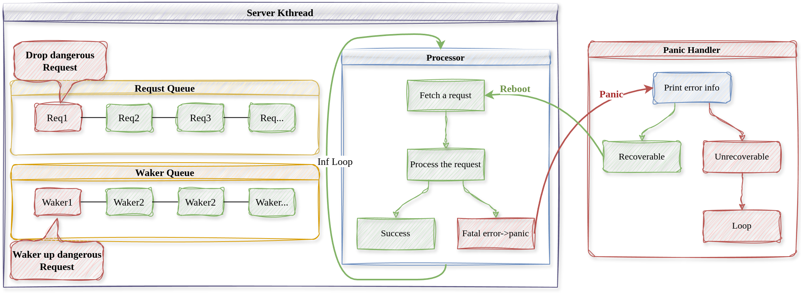

# 内核线程故障恢复

内核线程具有单独的控制流，前面我们说过，所有内核服务线程都有相同的入口，通过内核线程中内部的`Processor`成员来实现不同种类的请求处理：

```Rust
/// 服务内核线程统一入口，内部通过内核线程的
/// processor对象来具体处理请求
pub fn processor_entry() {
    // 获取内核线程
    let kthread = CURRENT_KTHREAD.get().as_ref().unwrap().clone();
    // 获取请求处理器
    let processor = kthread.processor();
    assert!(processor.is_some());
    let processor = processor.unwrap();

    // 循环响应请求
    loop {
        // 获取请求
        let (req, req_id) = match kthread.get_first_request() {
            Some((req, req_id)) => {
                kthread.set_current_request_id(req_id);
                (req, req_id)
            }
            None => {
                // 请求队列为空，则设置自己为Idle，放弃CPU直到请求入队时改变状态为NeedRun
                kthread.set_state(KthreadState::Idle);
                Scheduler::yield_current_kthread();
                continue;
            }
        };
        // 处理请求
        processor.process_request(req);
        // 响应请求，唤醒等待协程
        kthread.wake_request(req_id);
        println!("[{}] Request {} processed over!", kthread.name(), req_id,);
    }
}
```
可见内核线程不断地从请求队列中弹出请求进行处理，请求完成后要唤醒相应的等待协程，直到暂时没有请求时进入空闲状态。

我们说过，我们认为内核服务线程中运行的代码是不完全可靠的，可能会发生故障，内核如何捕获内核服务线程中的错误并进行恢复处理呢？下面的流程图解释了具体的控制流。



上图中，红色的部分表示有错误的控制流或请求，绿色表示正常的控制流。

当程序发生某些严重的错误时，Rust会抛出panic异常，这时控制流会跳转到程序中的全局panic处理程序`panic handler`中，我们就在`panic handler`中尝试恢复内核线程。

```Rust
#[panic_handler]
fn panic(info: &PanicInfo) -> ! {
    // 打印错误信息
    if let Some(l) = info.location() {
        println!(
            "[kernel] Panicked at {}:{} {}",
            l.file(),
            l.line(),
            info.message().unwrap()
        );
    } else {
        println!("[kernel] Panicked: {}", info.message().unwrap());
    }
    // 若是内核服务线程崩溃了，尝试恢复错误
    let current_kthread = CURRENT_KTHREAD.get().as_ref().unwrap().clone();
    match current_kthread.ktype() {
        KthreadType::ROOT | KthreadType::EXECUTOR | KthreadType::UNKNOWN => {
            println!("[Panic handler] Cannot reboot!");
        }
        KthreadType::BLK | KthreadType::FS => {
            let current_req_id = current_kthread.current_request_id();
            println!(
                "[Panic handler] Trying to Rebooting..., the dangerous request(ID: {}) will be dropped!",
                current_req_id
            );
            // 重启内核线程
            current_kthread.reboot(current_kthread.clone());
        }
    }
    loop {}
}
```
`panic handler`首先将错误信息打印出来告知用户，再判断错误是否可以恢复，若是内核主线程或协程执行器发生错误，则不能恢复，若是内核服务线程发生错误，则尝试重启内核线程以恢复错误。

```Rust
/// 重启内核线程，当内核线程内发生严重错误panic时在panic handler中使用（测试）
///
/// 首先唤醒出现错误的请求，重启后不再处理
///
/// 重置当前内核线程的rip和rsp，并不保存上下文切换到其他内核线程执行
pub fn reboot(&self, current_kthread: Arc<Kthread>) {
    // 重置上下文
    let current_req_id = self.current_request_id.get().clone();
    let context = self.context.get_mut();
    context.rip = processor_entry as usize;
    context.regs.rsp =
        KERNEL_STACK_BASE + self.ktid * KERNEL_STACK_SIZE * 2 + KERNEL_STACK_SIZE;
    // 唤醒出错的请求
    self.wake_request(current_req_id);
    let kthread = Scheduler::get_first_kthread().unwrap();
    KTHREAD_DEQUE.get_mut().push_back(current_kthread.clone());
    // 修改全局变量，且不保存寄存器
    *CURRENT_KTHREAD.get_mut() = Some(kthread.clone());
    current_kthread.switch_to_without_saving_context(kthread);
}
```
重启内核线程时，首先**唤醒出错的请求**，不然等待的内核线程将永远处于等待状态，我们认为出错的请求是危险的，将其丢弃重启后不再处理。然后将内核线程**rip和rsp现场恢复到初始状态**，当调度器再次调度错误内核线程时，从下一个请求开始继续处理。