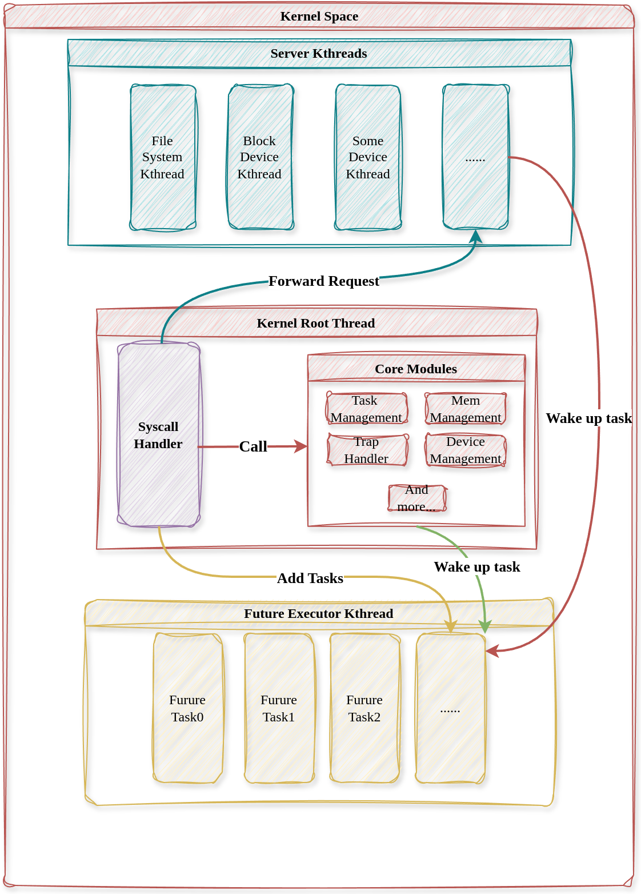

# 内核线程服务模型

前面我们已经介绍了内核线程数据结构，这一章我们给出一个具体的内核服务线程：文件系统服务线程。



内核服务线程是与协程执行线程与内核主线程的系统调用分发密切协作完成对用户线程的服务的。也就是我们之前多次提到的：**多对多线程模型**。

在上面的图中可以看到，用户请求内核线程服务被系统调用捕获后，同样是通过协程异步等待的方式来完成处理。首先创建一个`WaitForKthead`协程，再进入异步等待状态，内核线程服务完成后唤醒协程并唤醒用户线程。

```Rust
/// 当前线程等待一个内核线程完成某个请求
///
/// 这个协程是顶层协程，直接被执行器轮讯，需要保证在返回Ready前将等待中线程状态设置为Runnable
pub struct WaitForKthread {
    /// 等待的线程
    thread: Arc<Thread>,
    /// 被等待的内核线程
    kthread: Arc<Kthread>,
    /// 请求ID
    req_id: usize,
}


impl Future for WaitForKthread {
    type Output = ();
    fn poll(self: Pin<&mut Self>, cx: &mut Context<'_>) -> Poll<Self::Output> {
        // 已完成这个服务，返回Ready，且将等待线程唤醒
        if self.kthread.response_id() >= self.req_id {
            self.thread.set_state(ThreadState::Runnable);
            return Poll::Ready(());
        } else {
            println!(
                "[Executor] WaitForKthread poll pending, response_id: {}, req_id: {}",
                self.kthread.response_id(),
                self.req_id
            );
            // 服务未完成，将唤醒器注册到内核线程中去
            self.kthread.add_waker(cx.waker().clone(), self.req_id);
            Poll::Pending
        }
    }
}
```
`WaitForKthread`协程轮讯时根据内核服务线程的已响应请求id和等待请求id关系来判断是否已经完成服务。若没有完成服务，则将协程的唤醒器注册到内核服务线程中。

由于内核服务线程有自己的控制流，如果在内核服务线程中发生了严重的错误，内核本身不会崩溃，而是可以丢弃掉危险的请求并重启内核线程，我们将在[内核线程故障恢复](./内核线程故障恢复.md)中说明这个过程。