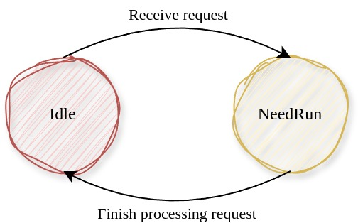

# 内核线程管理

我们之前提到：内核线程的设计是为了权衡性能和系统安全性。

衡量操作系统很重要的指标便是其支持的硬件设备的数量。Linux支持了非常多的设备，但这也导致75%的内核源代码都是设备驱动程序，驱动程序质量有好有坏。在Linux这种宏内核中，驱动程序运行时其地位是与内核代码等价的，如果一个低质量的驱动程序崩溃了，那整个系统也就崩溃了。

微内核将非核心的内核服务移到用户态就是为了保证内核代码的安全，防止某个系统组件崩溃导致整个系统不可用。

我们对于内核线程的设计也是基于上面的考虑。本质上来说，我们认为内核线程中运行的代码是不完全可靠的，因此将其放在独立的受内核控制的内核线程中。当任意内核线程崩溃时，内核有能力重启这个线程。

每个内核线程都执行一个特定的内核服务，内核线程借助Rust语言的内存安全特性保持独立，任何一个内核线程故障不会导致内核本身直接崩溃。每个内核线程共享内核地址空间，当内核线程间需要通信时，相对于微内核，也不需要频繁的IPC开销。

我们在这一节介绍内核线程结构的成员和方法，在后面的[内核线程服务模型](./内核线程服务模型.md)一章中具体介绍几种内核线程。

## Kthread

```Rust
/// 内核线程状态
#[derive(Default, Debug, Clone, Copy, Eq, PartialEq)]
pub enum KthreadState {
    #[default]
    /// 空闲
    Idle,
    /// 有请求等待处理，需要运行
    NeedRun,
}
```


内核线程只有两种状态，`Idle`表示空闲没有请求，而`NeedRun`表示尚有请求未处理完毕。

```Rust
/// 内核线程的内核态现场
#[derive(Default)]
#[repr(C)]
pub struct KernelContext {
    /// 被调用者保存寄存器
    pub regs: CalleeRegs,
    /// 内核线程入口现场
    pub rip: usize,
}
```

`KernelContext`表示内核线程的内核态上下文，包含了x86中被调用者保存的寄存器和rip，当发生内核线程切换时，内核线程将自己的内核态上下文保存在`context`成员上，再从新内核线程的`context`成员中弹出上下文执行。

```Rust
/// 内核线程的服务类型
#[derive(Default, PartialEq, Eq, Hash)]
pub enum KthreadType {
    /// 文件系统服务
    FS,
    /// 块设备服务
    BLK,
    ....
    /// 执行器
    EXECUTOR,
    /// 根线程
    ROOT,
    /// 未指定
    #[default]
    UNKNOWN,
}
```
目前为止，内核中存在多种服务线程和一个执行器线程，一个根线程。

- 每个服务线程提供一中独立的服务，不断地处理自己的请求队列。

- 执行器线程是用于轮讯并执行内核中产生的所有协程，我们将在[异步管理](./异步管理.md)中详细说明

- 根线程执行系统调用分发、中断处理和调度

```Rust
/// 内核线程
///
/// 每个内核线程有独立的内核栈
#[derive(Default)]
pub struct Kthread {
    /// 内核线程ID
    ktid: usize,
    /// 内核线程名称
    name: String,
    /// 内核线程的内核态上下文
    context: Box<KernelContext>,
    /// 运行状态
    state: Cell<KthreadState>,
    /// 服务类型
    #[allow(unused)]
    ktype: KthreadType,
    /// 用户请求的实际处理器
    processor: Option<Arc<dyn Processor>>,
    /// 请求队列
    request_queue: Cell<VecDeque<(Request, usize)>>,
    /// 请求的唤醒器队列
    request_wakers: Cell<Vec<(Waker, usize)>>,
    /// 最新的请求ID
    request_id: Cell<usize>,
    /// 已经响应的请求ID
    response_id: Cell<usize>,
}
```

- `context`成员表示内核线程的内核态上下文，注意和用户线程的`UserContext`区分，

- `stack_vmb`成员表示自己的内核栈虚存区域，每个内核线程栈都有独立的内核栈。

- `processor`成员用于处理具体的请求，其是一个实现了`Processor`trait的结构体，因为每个内核线程的提供的服务不同，所以对于请求的处理过程也不同。使用不同的实现了`Processor`的结构体便可以我们将所有的内核线程都统一起来。

- `request_queue`维护了内核线程收到的请求队列。

- `request_wakers`维护了请求队列中请求的唤醒器，类似于用户线程维护的唤醒器，这里的唤醒器用于唤醒那些正在等待内核线程服务的线程（在[异步管理](异步管理.md)中可以看到具体的例子）。

在[内核线程服务模型](./内核线程服务模型.md)一章中我们会详细说明几种内核线程对于`Processor`的实现。

```Rust
/// 解析请求类型并进行具体地处理
pub trait Processor: Send + Sync {
    /// 处理当前请求，完毕后唤醒相应的等待协程
    fn process_request(&self, request: Request);
}
```

## 创建和使用内核线程

### 创建内核线程：`new()`

```Rust
/// 创建内核线程
pub fn new(
    name: String,
    entry: usize,
    processor: Option<Arc<dyn Processor>>,
    ktype: KthreadType,
) -> Arc<Kthread> {
    let ktid = KTHREAD_ID.fetch_add(1, Ordering::Relaxed);

    // 两个线程栈之间空余一小段空间
    let stack_base = KERNEL_STACK_BASE + ktid * KERNEL_STACK_SIZE * 2;

    // 初始化内核现场
    let mut context = KernelContext::default();
    // 设置sp，ip
    context.regs.rsp = stack_base + KERNEL_STACK_SIZE;
    context.rip = entry;

    // 创建新内核线程
    let kthread = Arc::new(Kthread {
        ktid,
        name,
        context: Box::new(context),
        processor,
        ktype,
        ..Kthread::default()
    });

    // 将内核线程放入全局线程队列
    KTHREAD_DEQUE.get_mut().push_back(kthread.clone());
    kthread
}
```
每个内核线程都有自己的内核栈，两个内核栈之间空余了一小段空间，这是防止栈溢出时破坏其他内核线程的栈。

创建新内核线程时，初始化线程入口点和栈基地址。

### 上下文切换：`switch_to()`

```Rust
/// 切换到下一个内核线程
pub fn switch_to(&self, next: Arc<Kthread>) {
    unsafe {
        context_switch(&self.context, &next.context);
    }
}
```
内核线程切换时需要保存他的内核态现场，将自己的上下文保存在`KernelContext`结构中，并从另一个内核线程的`KernelContext`中恢复内核态现场。

`context_switch`是一段内嵌汇编程序，其保存当前内核线程的上下文并弹出另一个内核线程的上下文执行。

```asm
.text
.global 
context_switch: # (cur: &mut Context, nxt: &Context)
  # cur.context_ptr in rdi, nxt.context_ptr in rsi
  # Save cur's registers
  mov rax, [rsp] # return address
  mov [rdi + 56], rax # 56 = offsetof(Context, rip)
  mov [rdi + 0], rsp
  mov [rdi + 8], rbx
  mov [rdi + 16], rbp
  mov [rdi + 24], r12
  mov [rdi + 32], r13
  mov [rdi + 40], r14
  mov [rdi + 48], r15
  # Restore nxt's registers
  mov rsp, [rsi + 0]
  mov rbx, [rsi + 8]
  mov rbp, [rsi + 16]
  mov r12, [rsi + 24]
  mov r13, [rsi + 32]
  mov r14, [rsi + 40]
  mov r15, [rsi + 48]
  mov rax, [rsi + 56] # restore return address
  mov [rsp], rax # for stack balance, must use mov instead of push
  ret
```
## 内核线程入口函数

每个内核线程执行一项特定的内核服务，其入口函数是固定的，下面我们给出一个例子：

```Rust
/// 服务内核线程统一入口，内部通过内核线程的
/// processor对象来具体处理请求
pub fn processor_entry() {
    // 获取内核线程
    let kthread = CURRENT_KTHREAD.get().as_ref().unwrap().clone();
    // 获取请求处理器
    let processor = kthread.processor();
    assert!(processor.is_some());
    let processor = processor.unwrap();

    // 循环响应请求
    loop {
        // 获取请求
        let (req, req_id) = match kthread.get_first_request() {
            Some((req, req_id)) => (req, req_id),
            None => {
                // 请求队列为空，则设置自己为Idle，放弃CPU直到请求入队时改变状态为NeedRun
                kthread.set_state(KthreadState::Idle);
                Scheduler::yield_current_kthread();
                continue;
            }
        };
        // 处理请求
        processor.process_request(req);
        // 响应请求，唤醒等待协程
        kthread.wake_request(req_id);
        println!("[{}] Request {} processed over!", kthread.name(), req_id,);
    }
}
```

这是所有内核服务线程的共用入口，可见内核服务线程不断地弹出请求队列中的请求，处理请求，而具体的请求处理过程是由自己的`Processor`对象实现的，完成处理后唤醒等待的用户线程。

