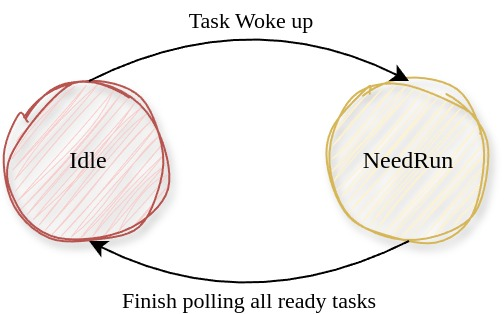

# 协程执行器

内核异步系统调用创建的所有异步协程都是由协程执行器来调度的。协程执行器维护一个协程队列，并循环轮询其中的所有任务，当任务完成时，相应的等待的用户线程状态也置为就绪，可以被内核调度继续执行。


```Rust
/// 执行器状态
pub enum ExecutorState {
    #[default]
    /// 无任务运行
    Idle,
    /// 需要运行
    NeedRun,
}
```


在上一节我们看到，当唤醒协程时会将执行器的状态也设置为`NeedRun`，而内核没有任何就绪协程时才会进入`Idle`状态。

```Rust
/// 协程执行器
pub struct Executor {
    /// 任务队列
    tasks_queue: Cell<VecDeque<Arc<Task>>>,
    /// 执行器状态
    state: Cell<ExecutorState>,
}
```


```Rust
impl Executor {
    /// 轮讯所有就绪任务直到没有任务是就绪态
    pub fn run_until_idle(&self) {
        for _ in 0..self.tasks_queue.len() {
            let task = self.tasks_queue.get_mut().pop_front().unwrap();
            if task.need_poll() {
                // 每次轮讯都让其睡眠，等待唤醒后被再次轮讯或直接返回Ready
                task.sleep();
                // 由task创建waker
                let waker = waker_ref(&task);
                // 由waker创建context
                let mut context = Context::from_waker(&*waker);
                match task.poll_inner(&mut context) {
                    Poll::Ready(_) => continue,
                    Poll::Pending => self.tasks_queue.get_mut().push_back(task),
                }
            } else {
                self.tasks_queue.get_mut().push_back(task);
            }
        }
    }
}
```
`run_until_idle`方法循环地轮询任务队列中所有就绪任务，直到没有任何就绪任务时停止。每次轮讯一个协程时，都将这个协程设置为睡眠，要么这个协程直接返回`Ready`，要么将自己的`Waker`注册到等待的事件中去，事件完成时唤醒协程再被第二次轮讯且这次必定返回`Ready`。

```Rust
/// 运行执行器直到没有就绪任务
pub fn run_util_idle() {
    EXECUTOR.get().set_state(ExecutorState::NeedRun);
    // 轮讯协程，直到任务队列中无就绪任务才停止
    EXECUTOR.run_until_idle();
    // 此时执行器任务队列中无就绪任务
    EXECUTOR.get().set_state(ExecutorState::Idle);
}

/// 是否需要调度执行
pub fn need_schedule() -> bool {
    EXECUTOR.get().state() == ExecutorState::NeedRun
}

/// 添加协程到执行器队列中
pub fn spawn(future: impl Future<Output = ()> + Send + Sync + 'static) {
    // 创建协程任务
    let weak_executor = Arc::downgrade(EXECUTOR.get());
    let task = Task::new(future, weak_executor);
    // 添加到执行器队列中
    EXECUTOR.get().add_task(task);
    // 协程执行器线程需要运行
    EXECUTOR.get().set_state(ExecutorState::NeedRun);
}
```
在内核中创建了一个全局协程执行器，其作为一个内核线程无限循环轮询所有的协程任务，处理所有用户线程的异步请求。

```Rust
/// 内核服务线程初始化，建立重要的内核服务线程
pub fn init() {
    // 创建内核协程执行器线程
    Kthread::new(
        "Executor".to_string(),
        executor_entry as _,
        None,
        KthreadType::EXECUTOR,
    );
    ...
}
```

```Rust
/// 协程执行器内核线程入口
pub fn executor_entry(_ktid: usize) {
    // 无限循环运行内核协程
    loop {
        executor::run_util_idle();
        Scheduler::yield_current_kthread();
    }
}

```
可见，全局协程执行线程的线程函数便是循环地轮询所有异步任务，当任务队列没有就绪任务时，主动放弃CPU调度其他内核线程。