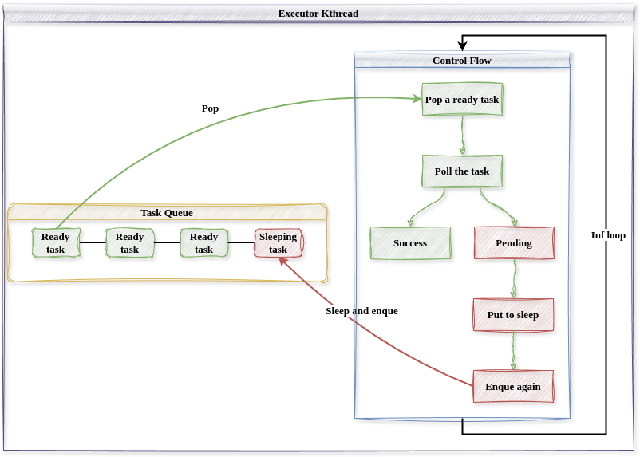

# 协程执行器线程设计

## async Rust简介

### 异步任务和Future trait

在 nCore 中,内核有时会产生不能立刻完成而需要等待的操作,比如异步式系统调用(如读磁盘)和内核服务线程模型(用户线程向内核服务线程发送请求后不能立马得到服务),我们称这种操作为异步任务。为了支持异步编程,Rust语言在核心库中提供了 Future Trait,表示实现了此 Trait 的结构体可能是一个尚未准备好的值,Future Trait 可以很好地表示内核中一个可能尚未完成的异步任务。Future Trait 对外暴露出一个 poll 接口,poll 接口接受代表当前 Future 上下文的 context 参数,用于轮询 Future 对象,每次 poll 可能返回执行成功或需要阻塞,内核通过不断调用 poll 接口,就可以查询异步任务是否执行结束从而进行下一步操作。context 变量的 wake 方法可以用于唤醒 Future 对象,通知内核 Future 应该再次被轮询(即被内核查询)。

多个 Future 可以进行组合、嵌套。在编译期,Rust 编译器将顶层的 Future 变成一个带有多个状态的状态机;在运行时,对于顶层 Future 的 poll 操作可能导致内部低层次的 Future 的poll 操作从而进入另一个中间状态或者终态。想要在内核中使用 Rust 的 async 机制和 Future Trait,我们需要一个用于轮询顶层 Future 的协程执行器(Executor),在 std 环境下,通常可以使用第三方库提供的 Executor,但是在 no_std 下,核心库 core 不提供实现,所以我们需要独立实现一个全局 Executor 来管理内核中产生的所有顶层 Future 对象。

### 层次化Future设计实现

nCore 内核中产生多种异步操作,这些操作都被实现为 Rust 语言提供的 Future Trait 对象,底层 Future 可以嵌套组合成为更高层次的 Future 从而实现复杂的异步逻辑,本节我们介绍几个底层 Future 和高层 Future 的实现,说明他们是怎么与Executor 协作的。

ThreadSwitchFuture是内核中最顶层的Future，其直接被Executor轮询，代表了新建一个用户线程，将其加入内核线程队列中等待执行。当协程执行器轮询此Future时，会首先设置当前线程并切换内核地址空间，最后轮询线程的控制流函数，即内部的Future，实际上其会轮询下面的`run_user`函数从而执行用户线程。

``` Rust
/// Top level future, directly polled by the executor.
///
/// Make sure every time poll this future, modify the CURRENT_THREAD.
pub struct ThreadSwitchFuture {
    thread: Arc<Thread>,
    future: Mutex<ThreadFuturePinned>,
}

impl ThreadSwitchFuture {
    /// Spawn a new thread that can be polled by executor.
    pub fn new(thread: Arc<Thread>, future: ThreadFuturePinned) -> Self {
        Self {
            thread,
            future: Mutex::new(future),
        }
    }
}

impl Future for ThreadSwitchFuture {
    type Output = ();
    fn poll(self: Pin<&mut Self>, cx: &mut Context<'_>) -> Poll<Self::Output> {
        // Switch vm.
        self.thread.proc.lock().vm.activate();
        set_current_thread(Some(self.thread.clone()));
        // Poll thread fn.
        let ret = self.future.lock().as_mut().poll(cx);
        set_current_thread(None);
        ret
    }
}
```

`run_user`函数是一个高层Future，其代表了一个用户线程的控制流逻辑，用户线程不断进入用户态运行，陷入内核处理中断或系统调用，直到线程退出为止。其中使用的系统调用处理分发函数`handle_user_trap`也是一个Future。

```Rust
/// 用户线程入口
///
/// loop:
/// - Get UserContext
/// - 进入用户态
/// - 处理中断/系统调用
/// - Put back UserContext
async fn run_user(thread: Arc<Thread>) {
    loop {
        if thread.inner.lock().state == ThreadState::Exited {
            break;
        }
        // 进入用户态
        let mut context = thread.begin_running();
        if let Some((_idx, info, sigmask)) = thread.handle_signal() {
            context = handle_signal(thread.clone(), context, info, sigmask);
        }

        context.run();
        // 返回内核，处理中断/系统调用
        handle_user_trap(thread.clone(), &mut context).await;
        thread.end_running(context);
    }
}
```

`handle_user_trap`函数处理系统调用或中断，其中系统调用分发函数`syscall`也是一个异步函数。可见，内核中通过底层的Future的组合嵌套，最终形成顶层Future而被Executor轮询，全局Executor轮询多个顶层Future（即用户线程）从而实现一个内核线程服务所有用户线程。（区别于Linux的一对一线程模型）。

```Rust
/// 处理用户态中断或系统调用
async fn handle_user_trap(thread: Arc<Thread>, ctx: &mut Box<UserContext>) {
    // 用户态系统调用
    if ctx.trap_num == 0x100 {
        //...
        let ret = syscall.syscall(syscall_num, args).await;
        ctx.set_syscall_ret(ret as _, 0);
        return;
    }

    // 内核或用户中断
    match ctx.trap_num {
        PAGE_FAULT => {
            // handle
        }
        TIMER => {
            // handle
        }
        _ => {
            unimplemented!();
        }
    }
}
```

## 协程执行器Executor设计实现

根据上面的讨论，我们知道Executor内核线程运行内核中的所有顶层Future（用户线程），下面我们讨论其实现。

协程执行器的控制流很简单,其循环取出可以查询的任务(sleep 标记为
false),并查询任务执行状态,若任务执行完毕,则进行下一次循环;若任务还在
执行中,则将此任务的 sleep 标记修改为 true,并将此任务重新加入任务队列中。
尚未完成的任务在其代表的异步操作完成后,sleep 标记会被重新修改为 false,从
而执行器会再次查询此任务,并返回成功。通过 sleep 标记的设计,任何一个异步
任务最多会被执行器查询两次。

下图描述了协程执行器内核线程的结构和控制流,协程执行器作为一个独立
的内核线程,负责处理内核中产生的所有异步任务。其维护了一个任务队列,任
务队列中的每一个任务都包含了一个 sleep 标记,用于表示此任务是否应该被执行
器查询,sleep 标记为 true 时,执行器暂时不查询此任务。



最终Executor暴露出`spawn`和`run_until_idle`接口，内核使用这些接口来添加用户线程和执行Executor。

```Rust
/// 运行执行器直到没有就绪任务
pub fn run_util_idle() {
    EXECUTOR.get().set_state(ExecutorState::NeedRun);
    // 轮讯协程，直到任务队列中无就绪任务才停止
    EXECUTOR.run_until_idle();
    // 此时执行器任务队列中无就绪任务
    EXECUTOR.get().set_state(ExecutorState::Idle);
}

/// 是否需要调度执行
pub fn need_schedule() -> bool {
    EXECUTOR.get().state() == ExecutorState::NeedRun
}

/// 添加协程到执行器队列中
pub fn spawn(future: impl Future<Output = ()> + Send + Sync + 'static) {
    // 创建协程任务
    let weak_executor = Arc::downgrade(EXECUTOR.get());
    let task = Task::new(future, weak_executor);
    // 添加到执行器队列中
    EXECUTOR.get().add_task(task);
    // 协程执行器线程需要运行
    EXECUTOR.get().set_state(ExecutorState::NeedRun);
}
```