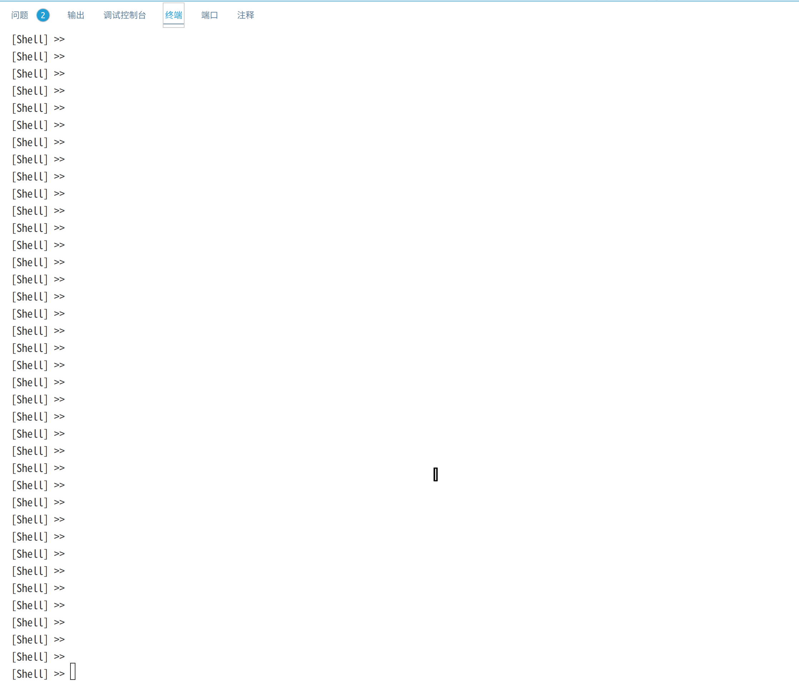
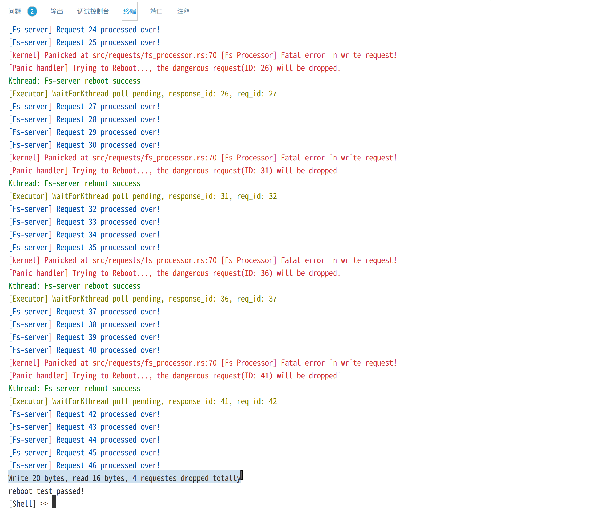
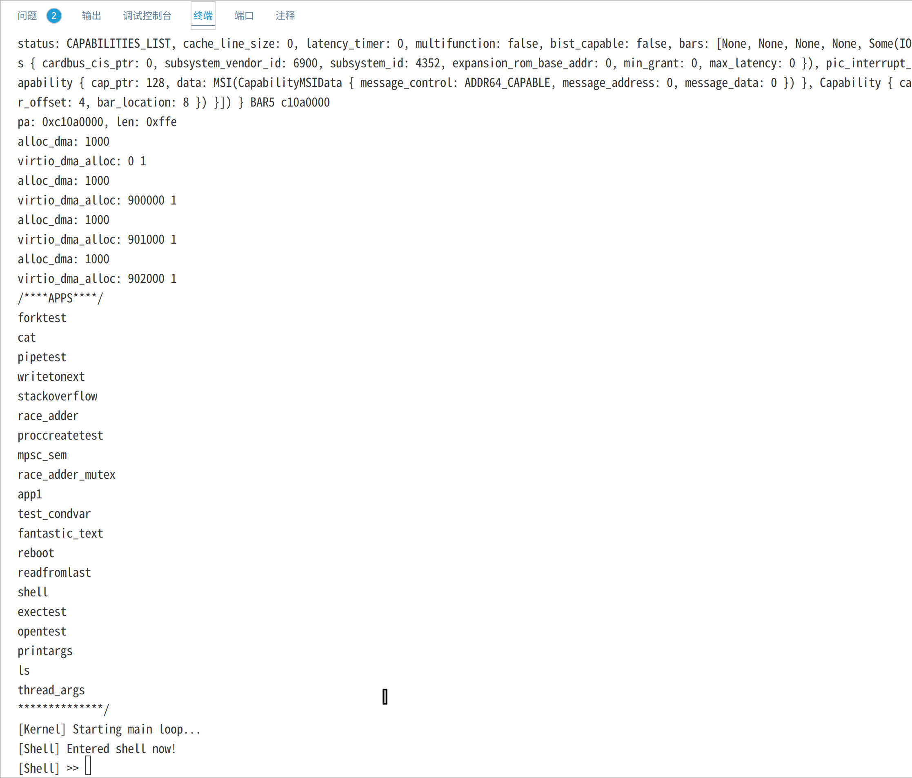

# 附录：效果演示

由于时间关系，目前只支持了Qemu平台。下面给出了一些在Linux系统上使用Qemu运行的效果演示：

## Reboot测试
reboot测试创建文件filea，并进行20次write系统调用，每次写入一个字符'a'。在文件系统内核服务线程的processor中，我们设置每响应5次write请求，就触发一个panic，以测试内核是否能够重启文件系统内核线程：

```Rust
// Write请求，进程Pid将buf中的数据写入文件表中fd对应的文件
FsReqDescription::Write(pid, fd, buf_ptr, buf_len, result_ptr) => {
    // 切换到进程所在地址空间
    activate_proc_ms(pid.clone());
    // [模拟致命错误]
    if PROCESSED_COUNT.load(Ordering::Relaxed) % 5 == 0 {
        PROCESSED_COUNT.fetch_add(1, Ordering::Relaxed);
        panic!("[Fs Processor] Fatal error in write request!");
    }
    ...
}
```



截图如下：



上图**红色部分是文件系统内核线程触发的panic错误信息**，**绿色部分表示内核成功重启了文件系统内核线程**，最终20次写请求有16个成功而4个请求重启后被丢弃，最终读出16个字节。

## Shell重定向

类似Linux，使用 > 和 < 来重定向输入输出，下面的测试创建printargs进程且将输出重定向到file1,再使用cat读取file1中的内容。printargs简单地将所有命令行参数输出：



## Shell管道

类似Linux，使用 | 将上一个进程的输出通过管道输送给下一个进程，下面的测试使用writetonext进程写字符串"Message from write-end!"到管道，再由进程readfromlast进程从管道读取并输出到终端：


## 内核带参数多线程

thread_args程序创建三个线程，每个线程打印1000个a,b或c。


## 内核并发同步原语
mpsc_sem是生产者消费者问题，测试内核中的信号量和互斥锁，而condvar_test测试内核条件变量。

