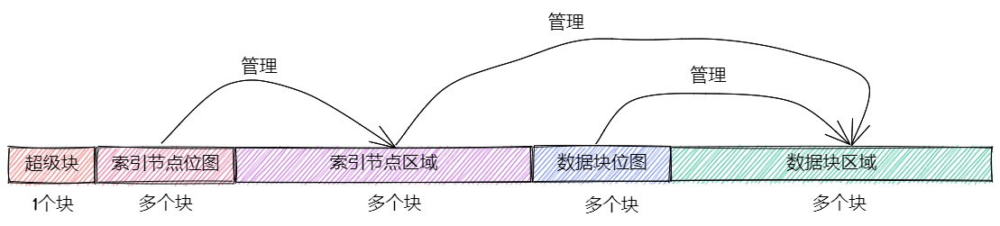

# 文件系统

由于文件系统较为复杂且时间有限，目前NUDT-OS采用的文件系统结构和实现借鉴于rcore-tutorial-rsicv。其给出了详细的说明[easy-fs](https://rcore-os.cn/rCore-Tutorial-Book-v3/chapter6/0intro.html)本章我们对文件系统做不做详细介绍，只是简要给出一个综合描述，然后给出内核中对easy-fs库的使用和接口。

>easy-fs是一个简化后的文件系统模型，后续计划能自行实现一个功能更加完善的文件系统（比如Ext2）。

easy-fs是一个简化的文件系统模型，但是具有完整的功能，下面是一个从rcore-tutorial中截取的文件系统描述：

* 扁平化：仅存在根目录 / 一个目录，剩下所有的文件都放在根目录内。在索引一个文件的时候，我们直接使用文件的文件名而不是它含有 / 的绝对路径。

* 权限控制：我们不设置用户和用户组概念，全程只有单用户。同时根目录和其他文件也都没有权限控制位，即完全不限制文件的访问方式，不会区分文件是否可执行。

* 不记录文件访问/修改的任何时间戳。

* 不支持软硬链接。

磁盘布局如下图（图片来自rcore-tutotial）：

下面的部分给出内核对easy-fs的使用和内核中的多种文件类型。