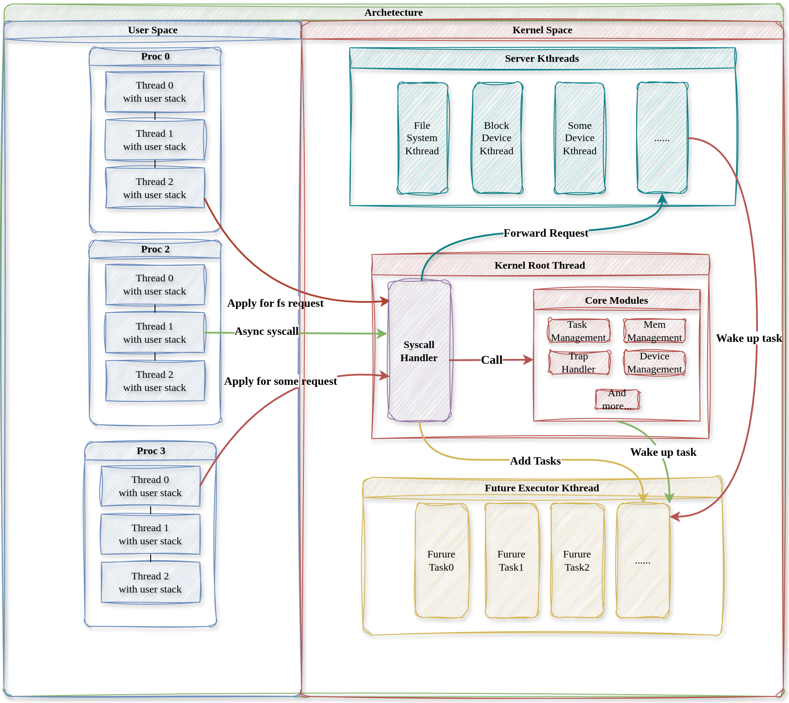

# 混合内核架构设计

我们在进行 nCore 内核架构设计时,综合考虑了宏内核与微内核架构的优劣,
基于以下几点考虑,来设计 nCore 内核架构。

• 宏内核中所有内核服务共享内核地址空间,从而提供良好的性能,但内核可
靠性和可拓展性较差,nCore 希望在提高内核可靠性和可拓展性的前提下尽
量提高内核性能。

• 微内核每个系统服务拥有独立的地址空间,具有良好的可靠性与隔离性,但
系统性能差,nCore 希望能够提供比微内核更优的性能。

• 业界曾经采用的混合内核架构如 Windows NT 在系统性能与安全可拓展性之
间采取折中的方案,将不同的系统服务一定程度上隔离为独立的内核线程,
但仍然共享内核地址空间,受损或有缺陷的系统服务仍然可能破坏其他系统
服务,但是 Rust 语言具有天生的内存安全特性,在不使用 unsafe 代码块的
情况下,正确的内核代码不会产生非法的内存操作以破坏其他的内核数据结
构,可以利用 Rust 语言的内存安全特性来实现混合内核中内核数据结构的
访存隔离性。

• nCore 的设计目标是权衡系统性能与可靠可拓展性,在微内核与宏内核之间
选择折中的混合内核,最终提供比微内核更好的性能,比宏内核更好的可靠
可拓展性。

从以上几点出发,我们将 nCore 设计为下所示的架构。非核心系统服务运行在独立的由 Rust 语言保证内存隔离性的内
核服务线程中,协程执行器内核线程轮询所有用户线程。两种内核线程共同为所有用户线程服务最终构成一个多对多线程模型（[多对多线程模型设计](多对多线程模型设计.md)）。

