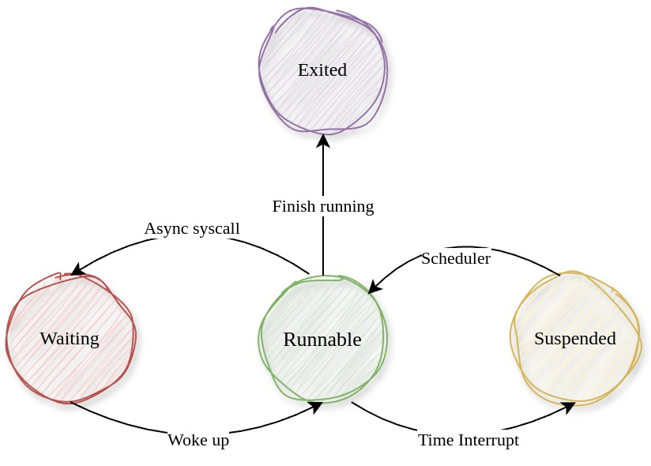

# 用户线程管理

线程是OS进行调度的最小单位，每个线程都有自己的指令执行流。

NUDT-OS使用`Thread`结构体表示用户线程。在前面我们提到Rust异步协程机制可以实现用户线程无独立的内核栈。

## 数据结构

```Rust
// kernel/src/task/thread.rs
pub enum ThreadState {
    /// 可运行
    Runnable,
    /// 异步等待
    Waiting,
    /// 被调度
    Suspended,
    /// 已退出, 可以被回收
    Exited,
}
```

线程具有四种状态，状态转移图如下所示：



`Waiting`状态表示线程正在等待某个事件，一般发生在异步系统调用（即线程需要等待某个事件发生才能继续执行）时，内核主线程将会创建一个协程将其添加到协程执行线程中，用户线程转为异步等待状态，当线程等待的事情发生时，唤醒用户线程，则再次转为可运行态。我们在后面的章节中会逐渐看到这整个过程。

`Suspended`状态表示线程的时间片用尽了，暂时被剥夺CPU，发生在时钟中断时。

```Rust
// 时钟中断，轮转用户线程或内核线程
        TIMER => {
            pic::ack();
            *pic::TICKS.get_mut() += 1;
            // 用户时钟
            if let Some(thread) = thread {
                // 时间片轮转
                thread.set_state(ThreadState::Suspended);
            // 内核时钟
            } else if let Some(_tf) = tf {
                // 当前内核线程主动调度
                Scheduler::yield_current_kthread();
            } else {
                panic!("Should never happen!");
            }
        }
```

```Rust
/// 用户线程
///
/// 用户线程共享内核线程栈
pub struct Thread {
    /// 线程id
    tid: usize,
    /// 线程所属进程
    proc: Weak<Process>,
    /// 线程状态
    state: Cell<ThreadState>,
    /// 线程执行的用户态上下文
    user_context: Cell<Box<UserContext>>,
    /// 栈内存区域
    #[allow(unused)]
    stack_area: Arc<MemoryArea>,
    /// 状态改变时的唤醒器
    state_wakers: Cell<Vec<(Waker, ThreadState)>>,
}
```
- `user_context`成员代表了用户线程的用户态上下文，线程进入用户态时将会从其中弹出上下文（通用寄存器，包括rip和rsp），而用户线程系统调用陷入内核时将用户态上下文保存在`user_context`上

- `state_wakers`成员包含了一个由线程状态和唤醒器构成的队列。当线程状态发生改变时，有可能唤醒某个正在等待这个状态的协程。比如说一个进程的主线程正在等待这个进程中的其他几个线程结束以回收（主线程为Waiting状态），这时子线程转为`Exit`状态时就可能会唤醒主线程（这个具体的过程在[异步系统调用](./异步管理.md)中）

- 可以看到，每个用户线程都有自己的用户栈`stack_area`，而没有独立的内核栈

`UserContext`结构表示用户态上下文，其来自rcore社区提供的`TrapFrame`库，这个库实现了线程由内核态以指定的上下文进入用户态和用户态发生系统调用时陷入内核这两个过程的汇编代码。

具体的过程比较复杂，这里不作展开，我们只需要知道用户线程在从内核态进入内核时，从UserContext结构中恢复用户态现场，在陷入内核时，将用户态现场保存在其中即可。

``` Rust
/// In TrapFrame
pub struct UserContext {
    pub general: GeneralRegs,
    pub trap_num: usize,
    pub error_code: usize,
}

/// 所有通用寄存器
pub struct GeneralRegs {
    pub rax: usize,
    pub rbx: usize,
    pub rcx: usize,
    pub rdx: usize,
   ...
}
```


## 创建和使用线程

### 创建用户线程: new()

```Rust
kernel/src/task/thread.rs
/// 创建线程，返回tid
pub fn sys_thread_create(entry: usize, arg1: usize, arg2: usize) -> (usize, usize) {
    let current_thread = CURRENT_THREAD.get().as_ref().unwrap().clone();
    let current_proc = current_thread.proc().unwrap();
    let tid = current_proc.alloc_tid();
    // 每两个用户栈之间隔一段空间
    let sp_base = USER_STACK_BASE + tid * 2 * USER_STACK_SIZE;
    let flags =
        PageTableFlags::WRITABLE | PageTableFlags::PRESENT | PageTableFlags::USER_ACCESSIBLE;
    // 分配用户栈
    let stack_area = MemoryArea::new(sp_base, USER_STACK_SIZE, flags);
    // 插入到当前进程所在的地址空间中
    let current_memoryset = current_proc.memory_set();
    current_memoryset.insert_area(stack_area.clone());
    let new_thread = Thread::new(
        Arc::downgrade(&current_proc),
        tid,
        entry,
        sp_base + USER_STACK_SIZE,
        arg1,
        arg2,
        stack_area,
    );
    new_thread.set_state(ThreadState::Runnable);
    current_proc.add_thread(new_thread);
    (tid, 0)
}

```
- 创建线程时提供其进入用户态的上下文，将其写入`user_context`结构中去

- 创建线程前还要先为其创建一个独立的用户栈虚拟内存区域


### 运行用户线程：run_until_trap()

`run_until_trap()`方法切换到当前线程所在进程的地址空间，再使用自己的用户态上下文运行，直到发生系统调用或者中断时控制流才返回Rust。

```Rust
/// 运行当前线程，当用户态发生中断或系统调用时控制流返回Rust
pub fn run_until_trap(&self) {
    // 切换当前线程所属进程的地址空间
    if let Some(proc) = self.proc.upgrade() {
        proc.memory_set().activate();
        // 刷新TLB
        tlb::flush_all();
    } else {
        panic!("[Kernel] Process already dropped");
    }
    self.user_context.get_mut().run()
}


/// In TrapFrame
/// impl UserContext
pub fn run(&mut self) {
    unsafe {
        syscall_return(self);
    }
}
```
利用rcore社区的`TrapFrame`库提供的`UserContext`的`run()`方法，使用当前的用户态现场进入用户态运行，直到遇到系统调用或者中断时返回内核。

与通常的做法不同，在用户态遇到中断和系统调用陷入内核时，控制流不是直接跳转到中断/系统调用处理函数，而是返回`run()`之后，所以我们需要手动进行系统调用或中断处理。

### 系统调用分发：do_syscall()

`do_syscall`方法从用户态上下文获取系统调用号和参数，并调用内核系统调用分发函数`syscall()`。

```Rust
/// 线程执行系统调用
pub fn do_syscall(&self) {
    let syscall_num = self.user_context.get_syscall_num();
    let args = self.user_context.get_syscall_args();

    // 执行系统调用
    let (ret0, ret1) = syscall(syscall_num, args);
    self.user_context.get_mut().set_syscall_ret(ret0, ret1);
}
```

这里的`syscall`是内核中的系统调用分发函数，根据系统调用号来分发到具体的处理过程

```Rust
/// 系统调用总控函数
pub fn syscall(syscall_id: usize, args: [usize; 6]) -> (usize, usize) {
    let syscall_id = num::FromPrimitive::from_usize(syscall_id).unwrap();
    let ret = match syscall_id {
        // 调试用
        DebugWrite => sys_debug_write(args[0]),
        DebugDataTransport => sys_debug_data_transport(args[0], args[1]),
        DebugOpen => sys_debug_open(args[0]),
        SerialRead => sys_serial_read(args[0]),
        GetTime => (*pic::TICKS as _, 0),

        // 任务相关
        ProcExit => sys_proc_exit(args[0]),
        ...
    };
    ret
}
```


## 内核运行用户线程
```Rust
/// 调度用户线程和内核线程
pub fn main_loop() {
    println!("[Kernel] Starting main loop...");
    loop {
        // 优先运行内核线程
        ...
        let uthread = Scheduler::get_first_uthread();
        // 运行用户线程
        if uthread.is_some() {
            let uthread = uthread.unwrap();
            // 修改当前线程
            *CURRENT_THREAD.get_mut() = Some(uthread.clone());
            // 持续运行用户线程直到其被挂起
            while uthread.state() == ThreadState::Runnable {
                uthread.run_until_trap();
                handle_user_trap(uthread.clone(), &uthread.user_context());
            }
            // 此时线程已被挂起
            clear_current_thread();
        }
}
```
内核维护了一个用户线程列表，并不断选出就绪的内核线程运行，并处理用户线程的系统调用请求和中断。