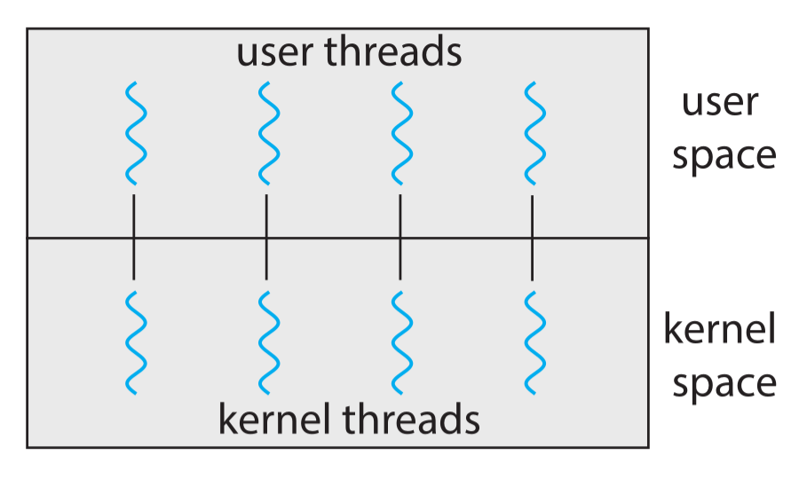
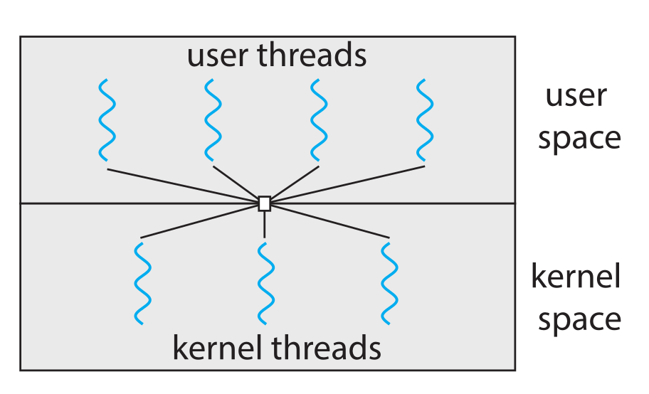

# 线程模型分析

在支持多线程的内核中，存在内核线程与用户线程两种线程对象，用户线程位于内核线程之上，它的管理无需内核支持，而内核线程由操作系统来直接支持与管理，只有内核线程才能通过操作系统调度以便运行于物理处理器。本节首先介绍常用的一对一和多对多线程模型设计。

## 一对一线程模型

一对一模型映射每个用户线程到一个内核线程,一个用户线程阻塞系统调用时,将内核现场保存在自己的内核栈上,并调度另一个线程继续运行。这种模型允许多个线程并行运行在多处理器系统上,唯一的缺点是,创建一个用户线程就必须创建一个相对应的内核线程,由于创建内核线程的开销会影响应用程序的性能而且每个内核线程都有独立的内核栈,所以这种模型的实现大多数**限制了系统支持的线程数量**以避免过大的性能和内存开销。Linux 系统和 Windows 操作系统家族都实现了这种模型。下图描述了一对一线程模型的映射关系:

## 多对多线程模型
多对多模型多路复用多个用户线程到同样数量或更少数量的内核线程。多对多线程模型不存在一对一模型的限制,系统可以创建任意数量的用户线程,并且相应的内核线程可以在多处理器系统上并发执行,且一个线程执行阻塞系统调用时可以调度另一个线程来执行。下图描述了多对多线程模型的映射关系：

我们在[多对多线程模型设计](多对多线程模型设计.md)中详细介绍了nCore的线程模型设计。
  
