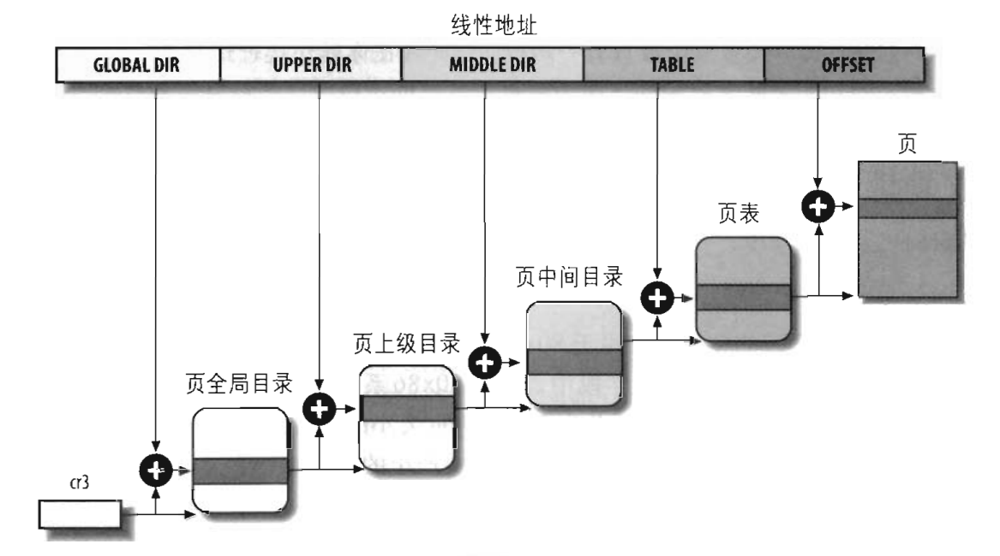

# 页表

本节介绍NUDT-OS中的页表抽象。

## 页表

```Rust
/// 页表
#[derive(Default)]
pub struct PageTable {
    /// 4级页表的起始物理地址
    root_pa: usize,
    /// 四级页表对应的四个物理页帧
    frames: Cell<Vec<PhysFrame>>,
}

```
页表结构体`PageTable`中包含了四级页表首地址，和一张四级页表使用的几个物理页帧（最多为4个）。

内核运行时，cr3寄存器中存放四级页表的起始物理地址，硬件的MMU模块寻址虚拟地址时会从cr3寄存器中取出页表地址并查询，最终转换得虚拟地址的物理地址。进程切换时，将cr3寄存器载入自己的页表的起始物理地址即实现了地址空间切换。

想要实现每个用户进程拥有独立的地址空间（也就是说每个进程有独立的虚拟地址到物理地址的映射，每个进程都可以使用相同的虚拟地址但是映射到不同的物理地址），我们只需要为每个进程创建一个独立的页表进行映射并保证每个物理地址不会被多次映射即可。

x64架构中虚拟地址的各字段含义和地址翻译过程见下图：

将上图中的地址翻译过程用Rust表示如下。



```Rust
/// 从虚拟地址获取四级页表索引，cr3中存四级页表首地址
///
/// 按这个索引取出的是三级页表首地址
const fn p4_index(va: usize) -> usize {
    (va >> (12 + 27)) & (ENTRY_COUNT - 1)
}

/// 从虚拟地址获取三级页表索引
const fn p3_index(va: usize) -> usize {
    (va >> (12 + 18)) & (ENTRY_COUNT - 1)
}

/// 从虚拟地址获取二级页表索引
const fn p2_index(va: usize) -> usize {
    (va >> (12 + 9)) & (ENTRY_COUNT - 1)
}

/// 从虚拟地址获取一级页表索引
const fn p1_index(va: usize) -> usize {
    (va >> 12) & (ENTRY_COUNT - 1)
}

/// 获取一个虚拟地址的四级页表项，可能创建低级页表
fn get_entry(paddr: usize, va: usize) -> &'static mut usize {
    let p4 = as_table(paddr);
    let p4e = &mut p4[p4_index(va)];
    let p3 = next_table_or_create(p4e);
    let p3e = &mut p3[p3_index(va)];
    let p2 = next_table_or_create(p3e);
    let p2e = &mut p2[p2_index(va)];
    let p1 = next_table_or_create(p2e);
    let p1e = &mut p1[p1_index(va)];
    p1e
}
```
最终实现页表的`map`和`unmap`方法，以将一对虚拟地址，物理地址映射关系写入页表

```Rust
/// 映射一个虚拟地址到一个物理地址，写入页表
impl PageTable {
    pub fn map(&mut self, va: VirtAddr, pa: PhysAddr, flags: PageTableFlags) {
        let entry = self.get_entry_or_create(va).unwrap();
        if !entry.is_unused() {
            panic!("{:#x?} is mapped before mapping", va);
        }
        *entry = PageTableEntry::new_page(pa.align_down(), flags);
    }

    /// 取消映射一个虚拟地址，清除页表
    pub fn unmap(&mut self, va: VirtAddr) {
        let entry = get_entry(self.root_pa, va).unwrap();
        if entry.is_unused() {
            panic!("{:#x?} is invalid before unmapping", va);
        }
        entry.0 = 0;
    }
}
```
